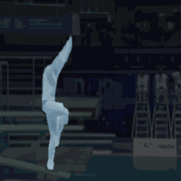
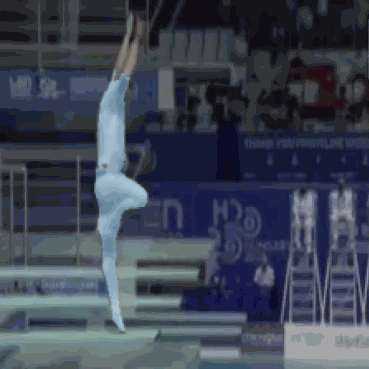
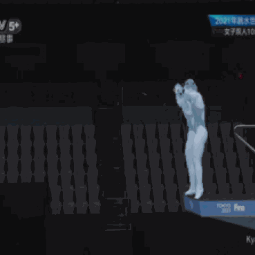
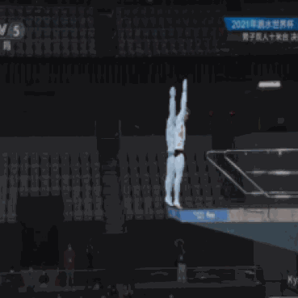
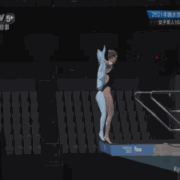

# FineParser: A Fine-grained Spatio-temporal Action Parser for Human-centric Action Quality Assessment

Created by [Jinglin Xu](http://39.108.48.32/XuWebsite/), [Sibo Yin](https://github.com/Yanruyu-Beta/), [Guohao Zhao](https://github.com/afasgafa), [Zishuo Wang](http://39.108.48.32/mipl/news/news.php?id=CHwangzishuo), [Yuxin Peng](http://39.108.48.32/mipl/pengyuxin/)

This repository contains the PyTorch implementation for FineParser (CVPR 2024, Oral).

[[Project Page]](https://pku-icst-mipl.github.io/FineParser_ProjectPage/) [[arXiv]](https://arxiv.org/abs/2405.06887)

## Overview

<center>
    
    <br>
    <div style="color:orange; border-bottom: 1px solid #d9d9d9;
    display: inline-block;
    color: #999;
    padding: 2px;">
  	</div>
</center>


## Examples of FineDiving-HM

<center>
<table>
  
  <tr>
    <td></td>
    <td></td>
    <td></td>
  </tr>
  <tr>
    <td></td>
    <td></td>
    <td></td>
  </tr>
 </table>
</center>

## Requirements

Make sure the following dependencies installed (python):

* pytorch >= 0.4.0
* matplotlib=3.1.0
* einops
* timm
* torch_videovision

```
pip install git+https://github.com/hassony2/torch_videovision
```


## Dataset & Annotations

### FineDiving Download

To download FineDiving dataset and annotations, please follow [FineDiving](https://github.com/xujinglin/FineDiving).

### FineDiving-HM Download
To download the FineDiving dataset, please sign the [Release Agreement](agreement/Release_Agreement.pdf) and send it to send it to Jinglin Xu (xujinglinlove@gmail.com). By sending the application, you are agreeing and acknowledging that you have read and understand the notice. We will reply with the file and the corresponding guidelines right after we receive your request!


The format of the FineDiving-HM dataset division is consistent with FineDiving. Please place the downloaded FineDiving-HM in `data`. 


<center>
    
    <br>
    <div style="color:orange; border-bottom: 1px solid #d9d9d9;
    display: inline-block;
    color: #999;
    padding: 2px;">
  	</div>
</center>


### Data Structure

```
$DATASET_ROOT
├── FineDiving
|  ├── FINADivingWorldCup2021_Men3m_final_r1
|     ├── 0
|        ├── 00489.jpg
|        ...
|        └── 00592.jpg
|     ...
|     └── 11
|        ├── 14425.jpg
|        ...
|        └── 14542.jpg
|  ...
|  └── FullMenSynchronised10mPlatform_Tokyo2020Replays_2
|     ├── 0
|     ...
|     └── 16 
└──FineDiving_HM
|  ├── FINADivingWorldCup2021_Men3m_final_r1
|     ├── 0
|        ├── 00489.jpg
|        ...
|        └── 00592.jpg
|     ...
|     └── 11
|        ├── 14425.jpg
|        ...
|        └── 14542.jpg
|  ...
|  └── FullMenSynchronised10mPlatform_Tokyo2020Replays_2
|     ├── 0
|     ...
|     └── 16 

$ANNOTATIONS_ROOT
|  ├── FineDiving_coarse_annotation.pkl
|  ├── FineDiving_fine-grained_annotation.pkl
|  ├── Sub_action_Types_Table.pkl
|  ├── fine-grained_annotation_aqa.pkl
|  ├── train_split.pkl
|  ├── test_split.pkl
```

## Training
Training on 4*NVIDIA RTX 4090.

To download pretrained_i3d_wight, please follow [kinetics_i3d_pytorch](https://github.com/hassony2/kinetics_i3d_pytorch/tree/master), and put `model_rgb.pth` in `models` folder.

To train the model, please run:
```bash
python launch.py
```

## Test
To test the trained model, please set `test: True` in [config](FineDiving_FineParser.yaml) and run:
```bash
python launch.py
```
